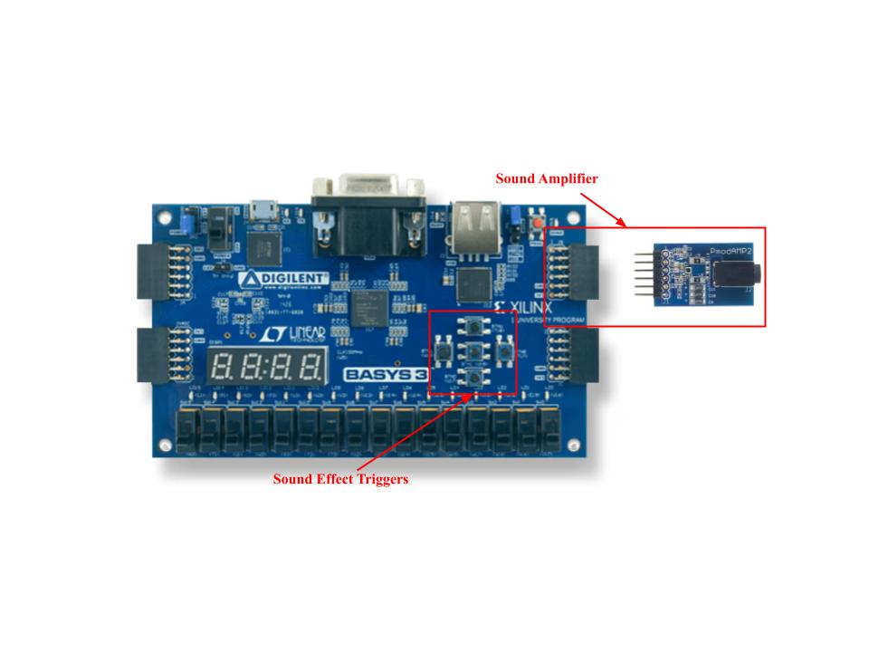

# Sound Effect Board (Basys 3 + PmodAMP2)

Application of the [PmodAMP2 (Revision A)](https://digilent.com/reference/pmod/pmodamp2/start?srsltid=AfmBOoq1yfyfdMDJaJH-_hVFo4jeQtLhvuQtrTVjmt5AkIL845PVjiOV) attachment on a [Basys 3 Artix-7 FPGA Board](https://digilent.com/shop/basys-3-amd-artix-7-fpga-trainer-board-recommended-for-introductory-users/). </br>
5 unique sound effects can be played from the amplifier when their respective buttons are pressed.

This may be of particular use to those taking UCLA's COM SCI M152A (Introductory Digital Design Laboratory), or any similar class, as a potential starting point on how to use this attachment in their final project. 

## FPGA Hardware & Software Requirements
As mentioned earlier, the hardware I used for this design is the Basys 3 FPGA along with the PmodAMP2 amplifier attachment. </br>
You will also need a standard 1/8 inch headphone jack and some kind of speaker to actually be able to hear the sounds when they play. </br>
In the demo videos (found in the DemoFiles folder), I use a guitar amp speaker which is extremely loud when the sound effects are played, but earbuds/headphones work just as well (but can also be very loud).

The source code for this design is written in Verilog (the .xdc Xilinx Design Constraints file is written in Tool Command Language). </br>
The synthesis and implementation of the code onto the FPGA board is handled by the [Vivado Design Suite](https://www.xilinx.com/support/download/index.html/content/xilinx/en/downloadNav/vivado-design-tools.html).


## Hardware & Software Setup
The setup for this design is simple. Attach the PmodAMP2 to the JB1-JB4 (upper B) Pmod row as shown in the image below:



If you want to place the PmodAMP2 in a different Pmod row on the Basys 3, make sure to update the basys3_boilerplate.xdc file to reflect such.

If you are using the Vivado Design Suite to program the FPGA board, the following files (which are all contained in the VivadoSourceCode folder) must be added to the Vivado project:

1. audio_player_top.v (Synthesis & Simulation File)
2. button_debouncer.v (Synthesis & Simulation File)
3. vine_boom_sound_effect.mem, smoke_detector_beep_sound_effect.mem, fart_sound_effect.mem, faaaaah_sound_effect.mem, correct_sound_effect.mem (Synthesis & Simulation Files) </br>
    - These can be found in the MemSoundEffects folder
4. basys3_boilerplate.xdc (Constraint File)

Any other file contained in this project directory should not be added to the Vivado project.

## Converting Sound Effects Between .mp3 and .mem
The sound effects used in the design are derived from [Myinstants.com](https://www.myinstants.com/en/index/us/), which allows you to download sounds in .mp3 format.

Verilog cannot directly read mp3 audio files, nor can the PmodAMP2 directly play mp3 audio files (at least not easily). </br>
However, Verilog CAN .mem files using $readmemh. So, to be able to play an .mp3 audio clip, we should first convert it to .mem

Below is the process I used to convert between .mp3 and .mem:

1. First we convert the .mp3 audio clip to .wav format, using [cloudconvert](https://cloudconvert.com/mp3-to-wav). Configure the conversion as such:
    - Audio Codec: pcm_s16le (Signed 16-bit Little Endian)
    - Channels: mono (Single Speaker Sound Output)
    - Sample Rate: 16,000 Hz (16,000 Samples/Second)
    - Audio Bitrate: 256 (16 bits/sample * 1 (mono) * 16000 samples/second = 256 Kbits Processed/Second)
    - Volume: no change (You can Increase/Decrease volume as you please)

2. Now, we convert from .wav to .mem, using the wav_to_mem.py script which can be found in the root directory of this project. </br>
    Note that this requires python on your device and pip install numpy/pip install scipy.io to run. </br>
    The wav_to_mem.py creates a .mem file ready for use in the source Verilog code. To use the script, use the following command format: </br>

    ```cmd
    python wav_to_mem.py sound.wav sound.mem
    ```

    - sound.wav is the path to the source .wav file, which should be in the format as described in step 1. </br>
    - sound.mem is the path to the destination .mem file, formatted for direct use in audio_player_top.v

    The script should also output the total number of samples in the created .mem file (you can also just look at the number of lines in the .mem file once it is created). This is important for when we actually add the .mem sound effects into audio_player_top.v, which stores the .mem samples in an array whose size must be specified (see the Audio ROM Storage code section in audio_player_top.v).

You may be wondering, why didn't I just cook up a script to convert directly between .mp3 and .mem? A few reasons:

1. The conversion between .mp3 and .wav in python would require pydub and ffmpeg. 
2. I don't want to do that. 
3. The method above works perfectly fine.

## Adding .mem Sound Effects to the Verilog Source Code
If you add the provided audio_player_top.v, button_debouncer.v, basys3_boilerplate.xdc, and the five .mem audio files to a Vivado project, you should be able to synthesize, implement, and generate a bitstream to program the Basys 3 without any errors, and it should be able to play all 5 sounds via the buttons as shown in the video demos found in the DemoFiles folder. 

If you want to use your own .mem sound effects (following the process described in the previous section) in your design, there are a few things you must keep in mind:

1. Source Code Updates: If you change the .mem sound effects, you will only need to update the audio_player_top.v source code. The main sections you will have to update are the Audio ROM Storage code section and the Playback Control code section. 

2. Storage Limit: The Basys 3 FPGA board has 1,800 Kbits of fast block RAM to store things like .mem files. Recall from earlier that we are taking 16,000 samples per second. Since each sample in the .mem file is 8 bits, each second of .mp3 audio will take up 16,000 * 8 = 128 Kbits of fast block RAM. Thus, the Basys 3 can store at most around 14 seconds of audio when using the conversion process as described above. For comparison, the five given audio files in this design range from 1-2 seconds (you can calculate the sound duration by dividing the total number of samples by 16,000) and take up a total of about 1,028 Kbits of fast block RAM. Keep this in mind if you are thinking of adding audio files that may be longer.

## Feedback/Mistakes?
Let me know if I'm tripping balls and there's actually a much easier or more efficient way to implement this. Thank you :)